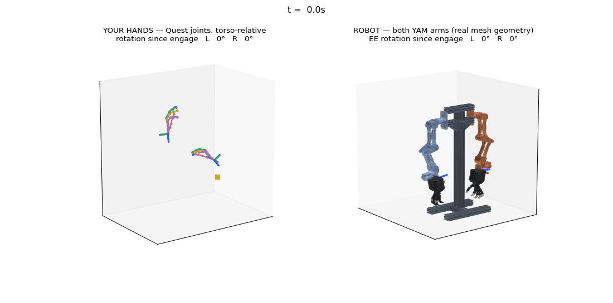
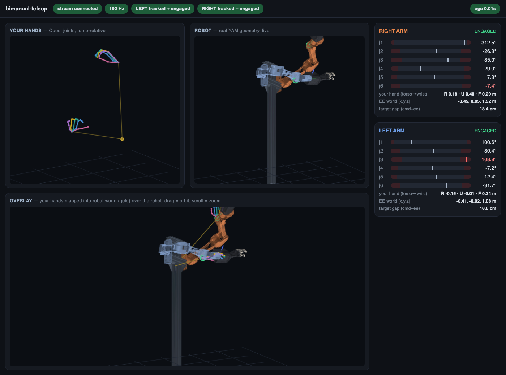
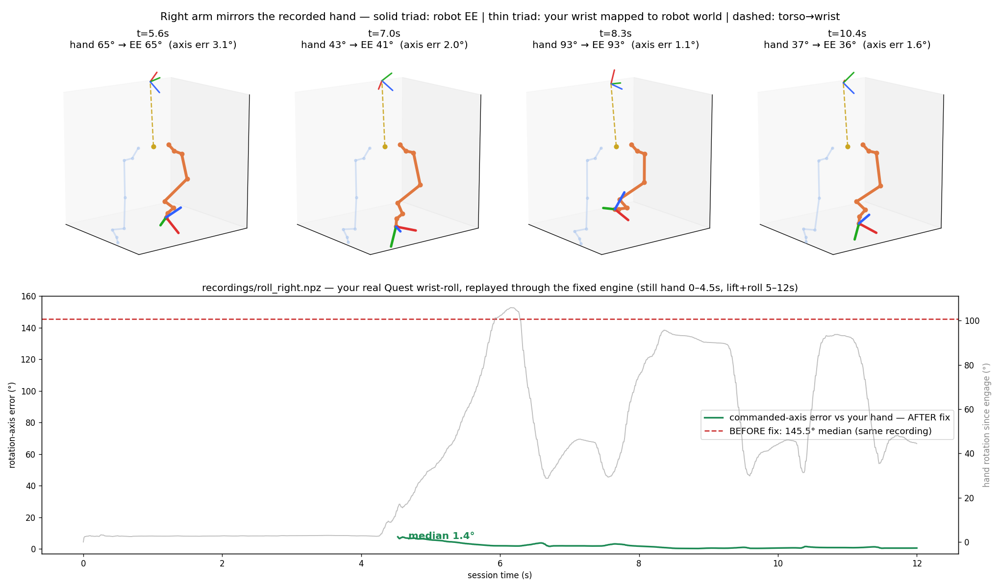
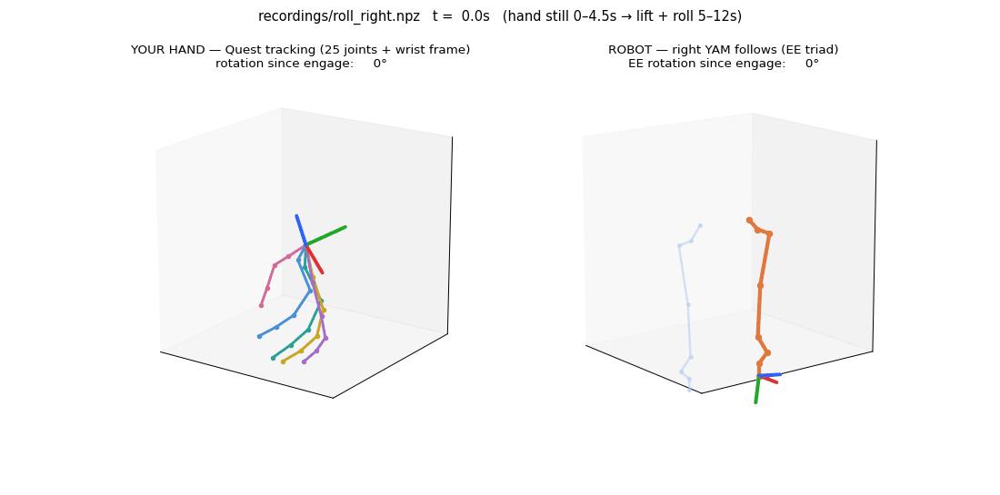

# Bimanual Humanoid Manipulator

VR teleoperation for a torso humanoid — **two i2rt YAM arms + two ORCA hands** on
an AgileX stand, driven by **Meta Quest 3/3S hand tracking**. No controllers, no
calibration ritual: put the headset on, and the robot's hands are your hands.



*A real recorded Quest session replayed through the engine: your 25-joint tracked
hands (left), the full robot — real YAM mesh geometry, AgileX stand, articulated
ORCA hands — following (right). Every frame above is produced by the exact same
code path that drives hardware.*

> **Deep dive:** [`docs/ARCHITECTURE.md`](docs/ARCHITECTURE.md) — full data flow,
> a 13-row failsafe inventory (each layer + its test), tooling index, and the
> ordered sim→real hardware-day checklist.

---

## The 60-second tour

```sh
uv sync --extra telemetry                                  # 1. install (see below for prereqs)
uv run python scripts/verify_stack.py                      # 2. full acceptance gate (165 tests + probes)
uv run python -m bimanual_teleop.launch.run_teleop --vr fake   # 3. run with a synthetic operator
uv run python scripts/dashboard.py                         # 4. watch it: http://127.0.0.1:8180
```

---

## Contents

1. [What this is](#1-what-this-is)
2. [Install](#2-install)
3. [See it move (no headset needed)](#3-see-it-move-no-headset-needed)
4. [The dashboard](#4-the-dashboard)
5. [Drive it with the Quest](#5-drive-it-with-the-quest)
6. [How the mapping works](#6-how-the-mapping-works)
7. [Record, replay, and prove it](#7-record-replay-and-prove-it)
8. [Render movies of any session](#8-render-movies-of-any-session)
9. [Manual keyboard jog (sim→real check)](#9-manual-keyboard-jog-simreal-check)
10. [Unity in-headset renderer](#10-unity-in-headset-renderer)
11. [Hardware day (Linux)](#11-hardware-day-linux)
12. [Configuration knobs](#12-configuration-knobs)
13. [Repo layout](#13-repo-layout)
14. [Verification status](#14-verification-status)

---

## 1. What this is

A headless Python runtime (MuJoCo-free — a check enforces it) that:

- ingests Quest hand/head poses (ORBIT native app over ZMQ/adb, Vuer/WebXR
  browser, a synthetic operator, or a replayed recording);
- maps your wrists to robot targets **absolutely and calibration-free**
  (your torso ↔ the robot's chest, your hand attitude ↔ its hand attitude);
- solves each YAM arm with a standalone Pinocchio/pink QP IK
  (position j1-j3 → analytic j6 twist → j4-j5 swing);
- retargets your 25 tracked hand landmarks to the 17 ORCA hand joints;
- publishes one latest-value `render.state` per tick (ZMQ msgpack + plain TCP
  JSON) consumed by the browser dashboard, the Unity Quest renderer, Rerun, and
  the offline analyzers;
- swaps a single sink object to drive real hardware (YAM CAN + ORCA serial on a
  Linux host) through a speed-capped, limit-clamped, PD-smoothed command shaper.

```text
Quest ORBIT app ──adb/ZMQ──► VRFrame (head, wrists, 25 landmarks, pinch)
                                  │
              Supervisor (staleness · dropout-hold · deadman clutch · e-stop)
                                  │ engaged?
                                  ▼
            Body-relative mapping (torso→wrist in body axes; head motion cancels)
                                  ▼
            ClutchMapper — ABSOLUTE position + ABSOLUTE orientation, glide on engage
                                  ▼
            Pinocchio/pink IK per arm (limits, elbow floor, workspace, anti-cross)
                                  ▼ q[6] per arm + 17 hand joints
        ┌─────────────────────────┴─────────────────────────┐
        ▼                                                     ▼
   RenderSink (ZMQ + TCP JSON)                       HardwareSink (Linux)
   dashboard · Unity · Rerun · analyzers             JointCommandShaper → CAN
```

---

## 2. Install

Prereqs: **Python 3.12** and [`uv`](https://docs.astral.sh/uv/) — that's it.
The repo is fully self-contained for everything except real hardware: the ORCA
hand model (render-grade meshes + joint configs, MIT, from
[orcahand/orcahand_description](https://github.com/orcahand/orcahand_description))
is vendored under `sim/models/orcahand_v2/`. Optional full-resolution sources
and the hardware drivers are picked up automatically if present:

```text
Developer/
├── Bimanual-Humanoid-Manipulator/   ← this repo (works standalone)
├── orcahand_description/            ← optional: full-res ORCA meshes (renderers prefer it)
└── orca_core/                       ← optional: ORCA driver (hardware + machine calibration)
```

```sh
cd Bimanual-Humanoid-Manipulator
uv sync                       # core runtime
uv sync --extra telemetry     # + Rerun viewer & mesh simplification (recommended)
uv sync --extra vr            # + Vuer browser-WebXR ingest (only if not using ORBIT)
```

Then prove the install:

```sh
uv run python scripts/verify_stack.py
```

This is the hardware-free acceptance gate used after every change: the full
pytest suite plus the body-relative probes, rig contract, no-MuJoCo guard, YAM
geometry provenance, synthetic IK trajectories, Unity render contract, launch
CLI checks, and record/replay + render-monitor smokes.

---

## 3. See it move (no headset needed)

Terminal 1 — run the engine with a synthetic operator (or loop a real recording
if you have one):

```sh
uv run python -m bimanual_teleop.launch.run_teleop --vr fake
# or, with a recorded session:
uv run python -m bimanual_teleop.launch.run_teleop --vr replay recordings/session.npz --loop
```

Terminal 2 — open the dashboard:

```sh
uv run python scripts/dashboard.py        # → http://127.0.0.1:8180
```

Other ways to look at the same stream:

```sh
uv run python scripts/render_monitor.py --seconds 5            # terminal numbers
uv run python -m bimanual_teleop.launch.run_teleop --vr fake --viz   # Rerun 3D viewer
```

---

## 4. The dashboard

One browser page with every piece of the puzzle, live:



- **Header chips** — stream connected, state age, loop Hz, per-side
  `TRACKED`/`ENGAGED`, calibration banner (if a legacy stillness hold is enabled).
- **YOUR HANDS** — the 25 tracked Quest joints per hand (colored fingers),
  placed torso-relative. This is exactly what arm control consumes.
- **ROBOT** — the real model: YAM arm meshes, AgileX stand, articulated ORCA
  hands posed by live FK on the streamed joint state. EE triads, command rings.
- **OVERLAY** — your hand skeletons mapped into robot world, drawn on top of the
  robot. Because orientation mapping is absolute, **your skeleton sits on the
  robot's hand**; any gap you see is IK reach/limits, not mapping.
- **Arm cards** — per-joint gauges against the real soft-limit ranges (red at
  the stops), your torso→wrist vector, EE world position, commanded-vs-achieved
  gap.

All panels drag-orbit and scroll-zoom. The page is served by `scripts/dashboard.py`
(stdlib only) from the same TCP JSON stream Unity uses — it works unchanged for
fake, replay, live Quest, jog, and hardware sessions.

---

## 5. Drive it with the Quest

Uses the **ORBIT** native Quest app (`com.ORBIT.Teleoperation`) streaming hand
tracking over USB.

1. Install ORBIT on the Quest, connect USB, allow the connection on-device.
   `adb devices` must list the headset (the launcher sets up all `adb reverse`
   port forwards itself).
2. Start the engine (+ dashboard in another terminal to watch):

   ```sh
   uv run python -m bimanual_teleop.launch.run_teleop --vr orbit --clutch gesture
   uv run python scripts/dashboard.py
   ```

3. Put the headset ON and **set both controllers down** — Quest hand tracking
   only streams with controllers asleep.
4. **Calibrate to enable the arms** (live sessions require an in-session fit —
   a fresh ORBIT recenter anchor invalidates any previous one): press
   **⊕ CALIBRATE** on the dashboard and follow the banner through three held
   poses (~2.5 s each): **1) relax both arms down at your sides, 2) press your
   palms together in front of your chest, 3) extend both arms straight forward
   at shoulder height.** The extended pose is LAST on purpose — it maps onto
   the robot's neutral, so when the fit completes the arms engage and **glide**
   (≈1 s, never snaps) onto the correspondence you are already holding.
5. The fit is POSITION-only (your hand spacing → robot hand spacing, your reach
   → robot reach, your clap → the robot's hands touching); it persists per
   machine (`config/operator_calib.json`) and `clear cal` discards it.
   Orientation is never calibrated. The arms freeze during the capture.
6. Clutch options: `--clutch gesture` (pinch to engage — the deadman; release =
   stop immediately) or `--clutch always` (for tests).
7. **Always record** — recordings make every later debugging session
   headset-free:

   ```sh
   uv run python -m bimanual_teleop.launch.run_teleop --vr orbit --clutch gesture --record recordings/$(date +%m%d_%H%M).npz
   ```

Quick ingest diagnostics if something seems off: `scripts/check_quest.py`
(prints the live torso→wrist vectors) and `scripts/check_roll.py` (guided
wrist-roll capture + analysis).

---

## 6. How the mapping works

One mental model, zero calibration:

> **The robot's chest is your torso, and its hands wear your hands.**
> WHERE your hand is relative to your torso = where the robot's hand is
> relative to its chest (1:1). HOW your hand is oriented relative to your body
> = how the robot's hand is oriented in its world.

- **Body-relative input** — arm control consumes the torso→wrist vector in your
  body axes (from the headset pose + `vr.torso_from_head`). Walking around or
  turning your whole body moves the robot **not at all**; only hand motion
  relative to your torso counts.
- **Absolute position** (`mapping.position_mode: absolute`) — target =
  robot-chest anchor + your torso→wrist vector. Verified on a real recording at
  **0.1 cm median** correspondence.
- **Absolute orientation** (`mapping.orientation_mode: absolute`) — the EE
  wears your hand's attitude through a *derived* hand↔EE convention (robot side
  from the frozen rest pose contract; operator side from hand axes measured off
  a real session — `mapping.hand_finger_axis` / `hand_palm_axis`). Verified:
  the overlay skeleton and the robot hand coincide at **0.00°** post-glide, and
  a wrist turn is inherently a pure j6 roll.
- **Glide, never snap** — on every (re)engage, the offset between where the
  robot is and where your hand says it should be decays over
  `mapping.engage_blend_s` (~1 s). Displacements map 1:1 from the first instant.
- **Honest clamps** — targets beyond the YAM's reach (e.g. far above its
  shoulder-mounted bases) clamp at the workspace/limit envelope; the anti-cross
  guard keeps each arm on its own side of the midline so the arms can never
  collide at center.
- **Hands** — your 25 tracked landmarks retarget every tick to the 17 ORCA
  joints (curl, splay, thumb, wrist), clamped to each joint's ROM.

History worth knowing: the first design calibrated an orientation correspondence
from a 5-second arms-at-sides hold. Done imperfectly (i.e. always), it scrambled
every rotation axis — **145° median axis error measured on a real session**. The
current mapping needs no stance, no hold, no per-user fitting:



---

## 7. Record, replay, and prove it

Every session can be captured and replayed **deterministically through the full
engine** — same mapping, same IK, same render stream:

```sh
uv run python -m bimanual_teleop.launch.run_teleop --vr orbit --record recordings/s.npz
uv run python -m bimanual_teleop.launch.run_teleop --vr replay recordings/s.npz          # once
uv run python -m bimanual_teleop.launch.run_teleop --vr replay recordings/s.npz --loop   # demos
```

Replay uses the recorded engagement decisions by default and refreshes delivery
timestamps so the safety supervisor doesn't see the recording as stale.

**The contract scorer** replays a recording and grades every mapping promise
with numbers — no headset, no opinions:

```sh
uv run python scripts/analyze_session.py recordings/s.npz --side right
```

It reports: absolute-orientation contract error (skeleton↔commanded attitude),
windowed translation direction error and magnitude ratio, absolute position
correspondence, IK tracking gap (separates "mapping wrong" from "solver
saturated"), and per-joint travel. Current scores on the reference recording:
orientation 0.0°/2.6° median (mapper/strict), translation 1.9° direction /
0.1 cm correspondence, IK tracking 0.1° median.

---

## 8. Render movies of any session

The watchable artifact — tracked hands vs the full robot model, side by side,
with per-frame rotation accounting:

```sh
uv run --with matplotlib python scripts/render_session.py recordings/s.npz --gif out/s.gif
# also: --sheet out/sheet.png | --static out/frame.png --at 8.3 | --debug-links
```



---

## 9. Manual keyboard jog (sim→real check)

Drive the arms by hand through the **same IK and sinks** as teleop — the tool
that proves sim transfers to real before any headset session touches hardware:

```sh
uv run python scripts/jog_arms.py              # render sink (watch on the dashboard)
uv run python scripts/jog_arms.py --sink hw    # REAL arms (Linux host, via the shaper)
```

Keys: `TAB` switch arm · `1-6` select joint · `=`/`-` jog it · `w/s/a/d/r/f`
nudge the EE in world axes through the IK · `[`/`]` step size · `h` home ·
`q` quit.

---

## 10. Unity in-headset renderer

Unity consumes the plain TCP JSON stream (`127.0.0.1:8102`) with zero package
dependencies and draws the robot + your torso→wrist overlay + a status HUD
inside the headset. Arm geometry is authoritative in Python (`arms.*.link_pos`
from live FK) — Unity never duplicates kinematics.

```sh
uv run python scripts/check_unity_contract.py        # static C# / schema contract
uv run python scripts/update_unity_fixture.py --check
uv run python scripts/run_unity_validation.py --require   # on a machine with Unity Editor
uv run python scripts/verify_stack.py --unity-editor
```

Project: `unity/TeleopRenderer/` · schema and coordinate notes:
[`docs/UNITY_BRIDGE.md`](docs/UNITY_BRIDGE.md).

---

## 11. Hardware day (Linux)

Real YAM control needs Linux/SocketCAN; macOS never talks to motors. The same
engine runs with `HardwareSink`, where **every** arm command passes through the
`JointCommandShaper`: clamped to the physical joint hardstops, per-joint
speed-capped (`hardware.rate_limit`, 1.2 rad/s default), critically-damped
PD-smoothed, initialized from the arm's measured pose. `run_hw` additionally
derates IK speed to 35% (`hardware.max_vel_scale`). The YAM's own 400 ms motor
watchdog and MIT-mode PD are the final backstop.

Follow the ordered checklist in
[`docs/ARCHITECTURE.md`](docs/ARCHITECTURE.md#simreal-checklist-the-linux-hardware-day) —
in short:

```sh
sudo ip link set can0 up type can bitrate 1000000      # and can1
uv pip install git+https://github.com/orcahand/orca_core   # ORCA hand driver
uv pip install -e ../i2rt                              # i2rt SDK on the host
uv run python scripts/verify_stack.py                  # gate ON the host
uv run python scripts/dashboard.py                     # watch everything
uv run python scripts/jog_arms.py --sink hw            # 1) jog FIRST, hand on e-stop
python -m bimanual_teleop.launch.run_hw --vr replay recordings/known_good.npz  # 2) replay on metal
python -m bimanual_teleop.launch.run_hw --vr orbit --clutch gesture            # 3) live, one hand at a time
```

`run_hw` starts idle behind the clutch; Ctrl+C releases torque. Verify the
dropout HOLD (cover a hand), the deadman (un-pinch), and the e-stop before
trusting it.

---

## 12. Configuration knobs

Everything physical lives in [`config/rig.yaml`](config/rig.yaml) and is guarded
by `scripts/check_rig_contract.py`. The ones you might actually touch:

| Knob | Meaning | Default |
|------|---------|---------|
| `vr.torso_from_head` | headset → sternum offset in body axes (the only operator-ish parameter) | `[0, -0.35, 0]` |
| `mapping.pos_scale` | hand-to-robot motion scale | `1.0` |
| `mapping.engage_blend_s` | glide-in time on (re)engage | `1.0` |
| `mapping.body_anchor_drop` | robot chest anchor below the shoulder plates | `0.15` |
| `hardware.rate_limit` | hard per-joint speed cap at the CAN boundary | `1.2 rad/s` |
| `hardware.max_vel_scale` | IK speed derate on real hardware | `0.35` |
| `ik.soft_margin` | per-joint soft limits (sized from the measured workspace) | see file |
| `safety.workspace` | EE target box per arm (base frame) | see file |

`mapping.position_mode` / `orientation_mode` / `twist_mode` switch to the legacy
relative behaviors — per-run diagnostics only; the contract check keeps the
defaults absolute.

---

## 13. Repo layout

```text
config/rig.yaml                  physical, mapping, IK, safety, hardware params
docs/ARCHITECTURE.md             system map · failsafe inventory · hardware checklist
docs/UNITY_BRIDGE.md             Unity subscriber schema and coordinate notes
docs/media/                      README media (rendered from real sessions)
unity/TeleopRenderer/            dependency-free Unity renderer + editor validation
scripts/
  verify_stack.py                THE acceptance gate (run after every change)
  dashboard.py                   browser dashboard (real-model 3D + gauges)
  jog_arms.py                    keyboard jog through the real IK/sinks
  analyze_session.py             replay a recording, grade every mapping contract
  render_session.py              hands-vs-robot GIF/sheet/frame renderer
  run_synthetic.py               headset-free IK isolation (line/circle/roll/pitch/yaw)
  check_quest.py · check_roll.py live Quest ingest diagnostics
  check_*.py                     contract probes (body-relative, rig, geometry, Unity, no-MuJoCo)
  render_monitor.py              terminal render.state subscriber/debugger
src/bimanual_teleop/
  engine.py                      VRFrame + engagement → sink commands
  vr/                            pose sources (orbit/vuer/fake/replay), body frames, ClutchMapper
  arms/                          Pinocchio YAM model, pink IK (swing–twist), arm controller
  hands/                         25-landmark → 17-joint ORCA retargeting
  safety/                        supervisor, clutch, command shaper
  render_sink.py · hardware.py   the two sinks (Unity/dashboard vs CAN/serial)
  viz/                           shared mesh/hand geometry, Rerun logger
tests/                           165 hardware-free tests (run via verify_stack or pytest)
```

---

## 14. Verification status

- `uv run python scripts/verify_stack.py` — **passing**: 165 tests + all probes
  and smokes (~105 Hz headless loop on an M-series Mac).
- Mapping contracts verified against a **real recorded Quest session**:
  orientation 0.00° overlay coincidence post-glide, translation 0.1 cm absolute
  correspondence, IK tracking 0.1° median.
- External validation still owed: Unity Editor batch validation (needs a Unity
  machine), in-headset Quest rendering, and the Linux hardware day (CAN latency,
  motor-count padding, ORCA serial throughput, watchdog behavior on metal).
