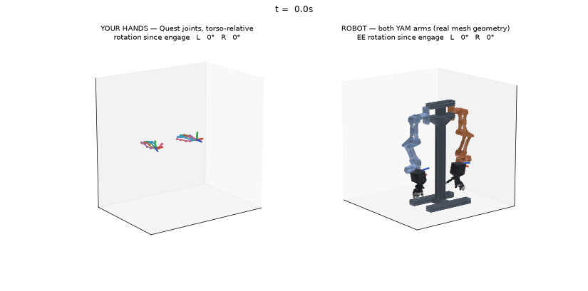
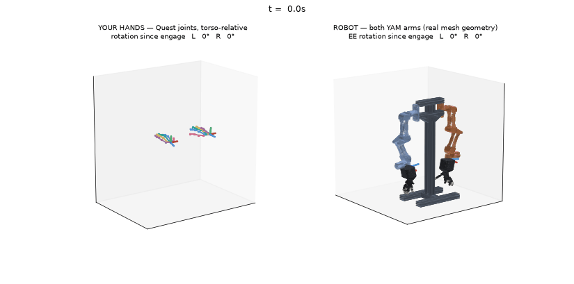

# Replay library — curated probe tapes (recorded 2026-06-12)

The canonical recordings for the sim→real checklist (ARCHITECTURE.md step 5:
replay on hardware, "no surprises allowed") and for regression-scoring mapping
changes. The tapes are COMMITTED under `replay_library/` (trimmed + session
fit embedded — self-contained on any clone); working copies and the untrimmed
`.raw.npz` originals stay in the gitignored `recordings/`.

Every tape is TRIMMED (the walk-to-the-laptop tail, and pick_place's first
10 s) and EMBEDS the calibration that ran during its session (`calib_json` in
the npz — replay/analyze apply it automatically; identity-scoring these tapes
is meaningless because ORBIT anchors moved ~1 m between sessions, see
SESSION_NOTES 2026-06-12). Untrimmed originals are kept as `<name>.raw.npz`;
each session's fit is also snapshotted as `<name>.calib.json`.

Scores below are with the analyzer in the LOCKED session-yaw frame (the frame
the engine actually maps in — scoring through the live head mis-graded every
session where the operator looked around; fixed 2026-06-12 afternoon). Tapes
start AT the probe: the in-session calibration sequence is cut (the embedded
fit makes that footage redundant — a replay engine applies it from frame 0).

| tape | len | what it probes | analyze (median): abs-corr / ori / IK | verdict |
|------|-----|----------------|----------------------------------------|---------|
| roll_right_left.npz | 24 s | pure wrist rolls to both stops, j6 saturation | 0.1 cm / 0.3° / 0.5° | **PASS** — primary hardware-day tape |
| reach_box.npz | 30 s | workspace envelope sweeps | 1.2 cm / 2.8° / 4.0° | **PASS** |
| wrist_swing.npz | 44 s | j4/j5 pitch+yaw swings | 0.0 cm / 0.0° / 0.2° | **PASS** (the earlier direction-gate FAIL was generated by the now-cut calibration footage) |
| clap.npz | 40 s | separation guard at contact | 1.3 cm / 1.4° / 1.8° | **PASS** — recorded BEFORE the clasp-crossing fix; replaying it now exercises the fixed wrist-line separation |
| pick_place.npz | 55 s | natural manipulation | 3.5 cm / 2.0° / 1.3° | **PASS** — real-manipulation tracking is clean; the earlier "grasp noise" reading was the analyzer frame artifact |
| fingers.npz | 41 s | finger curls/opposition, arms parked | 0.1 cm / 1.3° / 1.0° | PASSES the contract metrics — which is exactly the caveat: during sustained finger articulation the tracker's whole-hand hypothesis WANDERS (raw attitude excursions ~65° median, ~0.5 m command boxes, 100–500° cumulative joint travel on deliberately PARKED arms — measured on this probe content) and the robot follows it FAITHFULLY. The metrics score contract-fidelity, not signal sanity; the wander is upstream of the contract and coherent across landmarks AND the wrist stream, so no cross-check catches it. Arms-data decorative; the finger-landmark payload is the point. Remedy: record finger-only sessions with the GESTURE clutch (dashboard selector) so the arms stay parked |

Session fits (operator that day; axis_scale [lat, up, fwd] / body_offset):
roll_right_left [1.376, 0.971, 1.223] / [0, −0.889, 0.001] (retrofitted from
the engine log — lat_center/knots lost, plain lateral scale); reach_box
[1.32, 0.94, 1.426] / [0, −1.506, 0.808]; pick_place [1.399, 0.977, 1.366] /
[0, −1.486, 0.829]; clap [1.295, 1.017, 1.312] / [0, −1.794, 0.781];
wrist_swing [1.329, 0.948, 1.261] / [0, −1.472, 0.127]; fingers
[0.812, 0.903, 1.488] / [0, −1.492, 0.766] (lat 0.81 is an outlier vs
1.29–1.40 elsewhere — wide-spread calibration; harmless for a fingers tape).

Still to record: engage_cycles (gesture clutch), recenter_trip +
occlusion_no_trip (anchor-guard live validation), one deliberately sloppy
calibration (grade-threshold data).

Issue history from these tapes: (1) full-clasp crossing (clap.npz) — FIXED:
near-parallel capsules now separate along the wrist line (majority-shear
pushes 48%→0% on the tape); (2) finger-articulation hand-hypothesis wander
(fingers.npz) — inherent tracker limitation, mitigated operationally by the
gesture clutch (see table); (3) analyzer scored in the live-head frame —
FIXED (locked yaw). Remaining analyzer follow-up: gate the windowed direction
metric on displacement magnitude (wrist_swing's phantom FAIL).

> Score provenance: measured with the hard speed·dt target governor. The
> S-curve governor rework (in flight 2026-06-12) adds tracker lag that shifts
> correspondence medians a few cm (still PASS) — re-pin this table and
> re-render the movies once it lands.

## Movies

Rendered straight from the tapes (`scripts/render_session.py` — your tracked
hands left, the YAM arms right, rotation-since-engage readouts re-zeroed
post-glide). Each starts at the probe (calibration sequence cut) and plays at
roughly 2× speed.

| | |
|---|---|
| **rolls**  | **reach box**  |
| **wrist swings**  | **clap**  |
| **pick & place**  | **fingers**  |

Curation commands:

    uv run python scripts/trim_session.py recordings/tape.npz --head S --tail S \
        [--calib recordings/tape.calib.json] [-o out.npz]
    uv run python scripts/analyze_session.py recordings/tape.npz [--no-calib]
